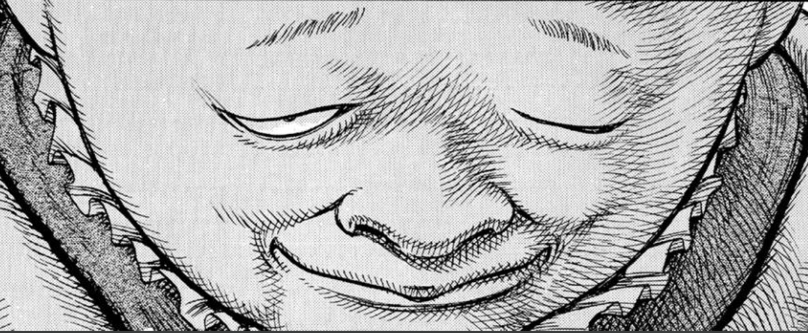
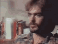
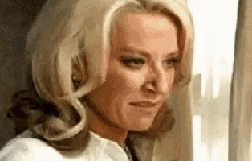
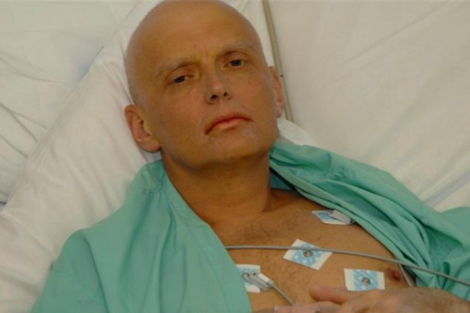
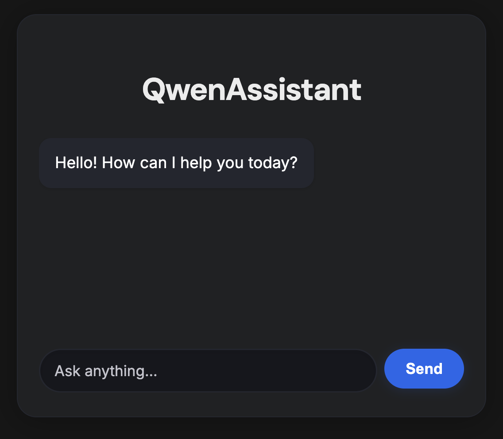

---
# You can also start simply with 'default'
theme: seriph
# random image from a curated Unsplash collection by Anthony
# like them? see https://unsplash.com/collections/94734566/slidev
background: https://cover.sli.dev
# apply unocss classes to the current slide
class: text-center
# https://sli.dev/features/drawing
drawings:
  persist: false
# slide transition: https://sli.dev/guide/animations.html#slide-transitions
transition: slide-left
# enable MDC Syntax: https://sli.dev/features/mdc
mdc: true
# open graph
# seoMeta:
#  ogImage: https://cover.sli.dev
---

# Bayesian Buccaneers

Arjuna James, Tyrone Nicholas, Ben Williams

---
transition: fade-out
---

# Animated Bullet Points

<ul>
<v-click><li></li></v-click>
<v-click><li></li></v-click>
<v-click><li></li></v-click>
<v-click><li></li></v-click>
<v-click><li></li></v-click>
<v-click><li></li></v-click>
<v-click><li></li></v-click>
</ul>

---

# ChatGPT + PPO: How It Started...

---

# After 2 Hours of Debugging...

---

# After 4 Hours of Debugging...

---

# After 6 Hours of Debugging...

---

# How It Ended

---

  <h1 style="font-size:2rem;">
    <a href="http://65.109.84.92:7000/" target="_blank">🇨🇳 Str8 Outta China</a>
  </h1>
  

---